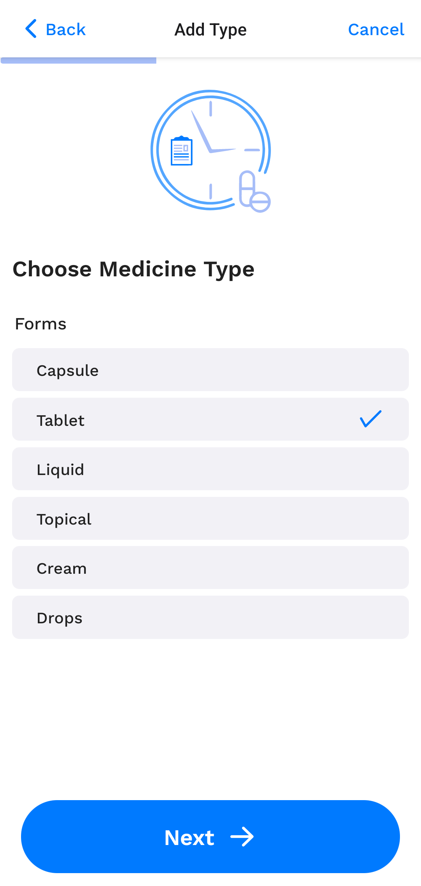
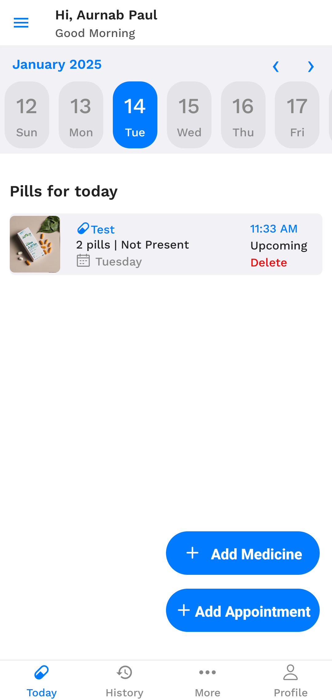
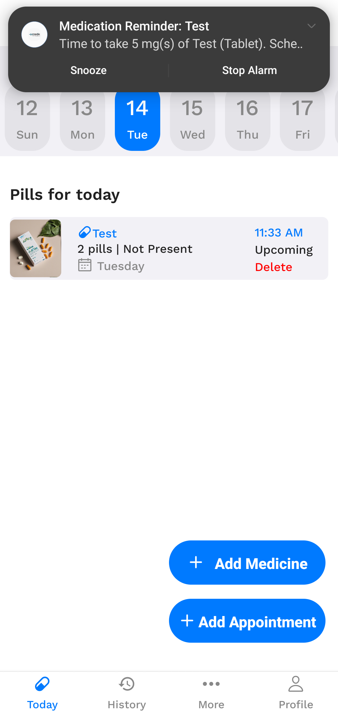
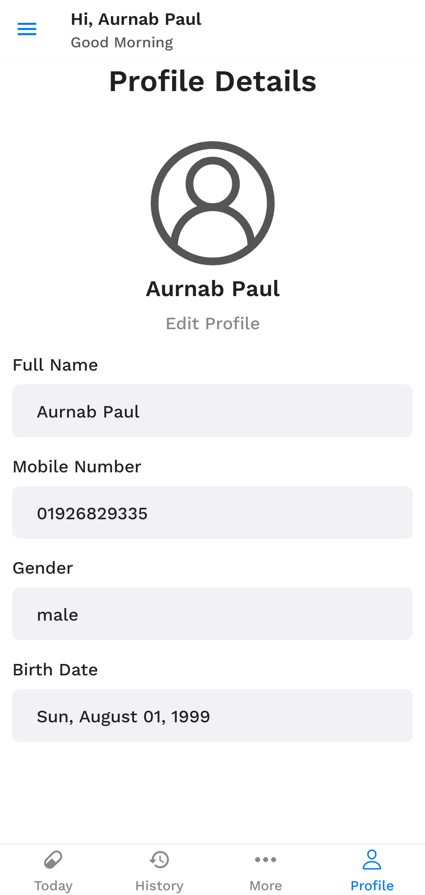
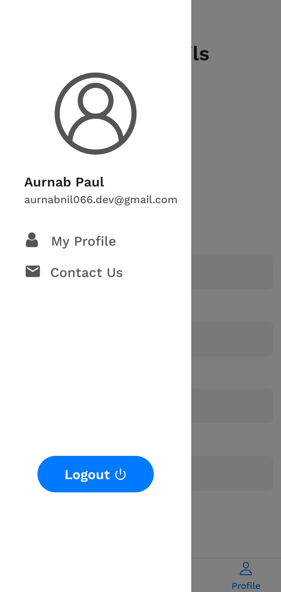

# About the Project
1. It is a medicine reminder app 
2. Different chips to save date, time, and dose for a particular medicine
3. Functionalities to save dose instructions, doctor appointments, and instructions
4. Facilitates a user to save his/her medicine doses and get reminders for them

# Screenshots

  
  
  
  

  
  
  
  

  
  
  

